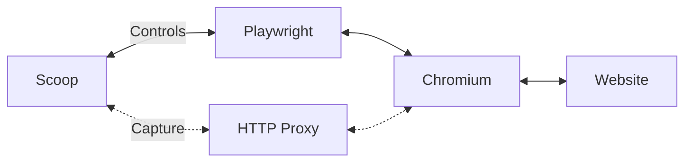
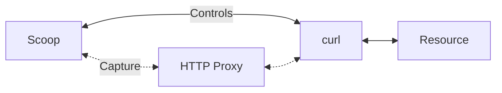

# Scoop 🍨

[](https://badge.fury.io/js/@harvard-lil%2Fscoop) [](https://standardjs.com) [](https://github.com/harvard-lil/scoop/actions/workflows/lint.yml) [](https://github.com/harvard-lil/scoop/actions/workflows/test.yml)

High-fidelity, browser-based web archiving library and CLI for one page or an explicit list of URLs.

**Use it in the terminal...**
```bash
scoop "https://lil.law.harvard.edu"
```

**... or in your Node.js project**
```javascript
import { Scoop } from '@harvard-lil/scoop'

const capture = await Scoop.capture('https://lil.law.harvard.edu')
const wacz = await capture.toWACZ()
```

<a href="https://tools.perma.cc"></a>

---

## Summary
- [About](#about)
- [Main Features](#main-features)
- [Getting Started](#getting-started)
- [Using Scoop on the command line](#using-scoop-on-the-command-line)
- [Using Scoop as a JavaScript library](#using-scoop-as-a-javascript-library)
- [Development](#development)
- [FAQ](#faq)

---

## About

**Scoop** is a high fidelity, browser-based, web archiving capture engine for witnessing the web from the [Harvard Library Innovation Lab](https://lil.law.harvard.edu). 

Fine-tune this custom web capture software to create robust captures of selected web pages with accurate and complete **provenance information**.

With extensive options for asset formats and inclusions, Scoop will create **.warc**, **warc.gz** or **.wacz** files to be stored by users and replayed using the web archive replay software of their choosing.

Scoop also comes with built-in support for the [WACZ Signing and Verification specification](https://specs.webrecorder.net/wacz-auth/0.1.0/), 
allowing users to cryptographically sign their captures. 

**More info:**
- ["Witnessing the web is hard: Why and how we built the Scoop web archiving capture engine 🍨"](https://lil.law.harvard.edu/blog/2023/04/13/scoop-witnessing-the-web/)<br>
April 13 2023 - _lil.law.harvard.edu_
- ["New Release: High Fidelity Capture Engine for Witnessing the Web 🍨"](https://blogs.harvard.edu/perma/2023/03/28/867/)<br>
March 28 2023 - _blogs.harvard.edu/perma_

[👆 Back to the summary](#summary)

---

## Main Features
- High-fidelity, browser-based capture of individual pages or explicit URL lists with [no alterations](https://lil.law.harvard.edu/blog/2023/04/13/scoop-witnessing-the-web/#no-alteration-principle)
- Highly configurable
- Optional attachments: 
  - Provenance summary
  - Screenshot
  - Extracted videos with associated subtitles and metadata
  - PDF snapshot
  - DOM snapshot
  - SSL certificates
- Support for `.warc.`, `.warc.gz` and `.wacz` output formats
  - Support for the [WACZ Signing and Verification specification](https://specs.webrecorder.net/wacz-auth/0.1.0/)
  - Optional preservation of _"raw"_ exchanges in WACZ files for later analysis or reprocessing _("wacz with raw exchanges"_)

### Examples and screenshots
- 💾 [Sample WACZ file captured with Scoop](/.github/assets/example.wacz?raw=true).<br>
Playback software such as [replayweb.page](https://replayweb.page/) can be used to explore this sample capture.
- 📷 [Entry points](/.github/assets/screenshot-entry-points.png?raw=true)
- 📷 [Web Capture](/.github/assets/screenshot-web-capture.png?raw=true)
- 📷 [Provenance Summary](/.github/assets/screenshot-provenance-summary.png?raw=true)
- 📷 [PDF Snapshot](/.github/assets/screenshot-pdf-snapshot.png?raw=true)
- 📷 Embedded videos as attachments [[1]](/.github/assets/screenshot-video-as-attachment-1.png?raw=true) [[2]](/.github/assets/screenshot-video-as-attachment-2.png?raw=true)

[👆 Back to the summary](#summary)

---

## Getting started

### Dependencies and requirements
**Scoop** requires [Node.js 22+](https://nodejs.org/en/).

Other _recommended_ system-level dependencies: 
[curl](https://curl.se/), [python3](https://www.python.org/) (for `--capture-video-as-attachment` option).

While the amount of resources **Scoop** needs is entirely dependent on what is being captured, a minimum of **4GB of RAM** seems to be indicated for complex captures.

### Compatibility
This program has been written for UNIX-like systems and is expected to work on **Linux, Mac OS, and Windows Subsystem for Linux**.

### Chromium sandbox

Chromium sandboxing is enabled by default. The host or container must support sandboxing. For Linux containers, use a non-root user and a compatible seccomp configuration; see [Playwright's Docker guidance](https://playwright.dev/docs/docker#crawling-and-scraping).

To disable this protection explicitly, pass `--chromium-sandbox false` or set `chromiumSandbox: false` in the library options.

### Installation

**Scoop** is available on [npmjs.org](https://www.npmjs.com/package/@harvard-lil/scoop) and can be installed as follows:
 
```bash
# As a CLI
npm install -g @harvard-lil/scoop

# As a library
npm install @harvard-lil/scoop --save

# In both cases, you may need to install Playwright's dependencies: 
sudo npx playwright install-deps chromium
```

<details>
  <summary><strong>Trouble installing the CLI?</strong></summary>


- Make sure you are running Node.js 22 or later (`node -v`)
- Permissions issues are a common when installing `npm` packages globally for the first time. 
See [npm's documentation](https://docs.npmjs.com/resolving-eacces-permissions-errors-when-installing-packages-globally) for solutions.
- On certain systems, using `install-deps` without the `chromium` argument might be necessary:
```bash
sudo npx playwright install-deps
```
- [npx may be used](https://docs.npmjs.com/cli/v9/commands/npx) as an alternative to a global installation:
```bash
# In a new folder
npm init
npm install @harvard-lil/scoop
npx scoop "https://example.com"
```
</details>


[👆 Back to the summary](#summary)

---

## Using Scoop on the command line

Here are a few examples of how the `scoop` command can be used to make a customized capture of a web page.

```bash
# This will capture a given url using the default settings.
scoop "https://lil.law.harvard.edu" 

# Unless specified otherwise, scoop will save the output of the capture as "./archive.wacz".
# We can change this with the `--output` / `-o` option
scoop "https://lil.law.harvard.edu" -o my-collection/lil.wacz

# But what if I want to change the output format itself?
scoop "https://lil.law.harvard.edu" -f warc -o my-collection/lil.warc

# By default, Scoop runs in headless mode. 
# I can turn the "headless" flag off to see what happens in Chromium during capture.
scoop "https://lil.law.harvard.edu" --headless false

# Although it comes with "good defaults", scoop is highly configurable ...
# timeout-related options are good 
scoop "https://lil.law.harvard.edu" --capture-video-as-attachment false --screenshot false --capture-window-x 320 --capture-window-y 480 --capture-timeout 30000 --max-capture-size 100000 --signing-url "https://example.com/sign"

# ... use --help to list the available options, and see what the defaults are.
scoop --help

# Timeout-related options are good dials to turn first when trying to customize "how much" of a page to capture.
scoop "https://lil.law.harvard.edu" --capture-timeout 90000 --load-timeout 60000 --network-idle-timeout 30000
```

<details>
  <summary><strong>See: Output of scoop --help 🔍</strong></summary>

```
Usage: scoop [options] <urls...>

🍨 High-fidelity, browser-based, single-page web archiving library and CLI.
More info: https://github.com/harvard-lil/scoop

Options:
  -v, --version                                          Display Scoop and Scoop CLI version.
  -o, --output <string>                                  Output path. (default: "./archive.wacz")
  -f, --format <string>                                  Output format. (choices: "warc", "warc-gzipped", "wacz", "wacz-with-raw", default: "wacz")
  --json-summary-output <string>                         If set, allows for saving a capture summary as JSON. Must be a path to .json file. Written for failed captures too, whose summary has the FAILED state.
  --export-attachments-output <string>                   If set, allows for exporting attachments (screenshot, certs, ...). Must be a path to an existing directory.
  --signing-url <string>                                 Authsign-compatible endpoint for signing WACZ file.
  --signing-token <string>                               Authentication token to --signing-url, if needed.
  --deduplicate-payloads                                Deduplicate eligible WARC payloads at export (default: false); raw storage and network traffic are unchanged.
  --screenshot <bool>                                    Add screenshot step to capture? (choices: "true", "false", default: "true")
  --pdf-snapshot <bool>                                  Add PDF snapshot step to capture? (choices: "true", "false", default: "false")
  --dom-snapshot <bool>                                  Add DOM snapshot step to capture? (choices: "true", "false", default: "false")
  --capture-video-as-attachment <bool>                   Add capture video(s) as attachment(s) step to capture? (choices: "true", "false", default: "true")
  --capture-certificates-as-attachment <bool>            Add capture certificate(s) as attachment(s) step to capture? (choices: "true", "false", default: "true")
  --provenance-summary <bool>                            Add provenance summary to capture? (choices: "true", "false", default: "true")
  --attachments-bypass-limits <bool>                     If active, attachments will not count towards time and size constraints imposed on capture (--capture-timeout, --max--capture-size). (choices: "true", "false", default: "true")
  --capture-timeout <number>                             Time budget shared by all URLs, in ms. (default: 60000)
  --load-timeout <number>                                Max time Scoop will wait for the page to load, in ms. (default: 20000)
  --network-idle-timeout <number>                        Max time Scoop will wait for the in-browser networking tasks to complete, in ms. (default: 20000)
  --behaviors-timeout <number>                           Max time Scoop will wait for the browser behaviors to complete, in ms. (default: 20000)
  --capture-video-as-attachment-timeout <number>         Max time Scoop will wait for the video capture process to complete, in ms. (default: 30000)
  --capture-certificates-as-attachment-timeout <number>  Max time Scoop will wait for the certificates capture process to complete, in ms. (default: 10000)
  --capture-window-x <number>                            Width of the browser window Scoop will open to capture, in pixels. (default: 1600)
  --capture-window-y <number>                            Height of the browser window Scoop will open to capture, in pixels. (default: 900)
  --screenshot-max-width <number>                        Clip full-page screenshots to this width, in pixels. 0 means no limit. (default: 0)
  --screenshot-max-height <number>                       Clip full-page screenshots to this height, in pixels. 0 means no limit. (default: 0)
  --max-capture-size <number>                            Received-byte budget shared by all URLs, in bytes. (default: 209715200)
  --max-video-capture-size <number>                      Size limit for the video attachment, in bytes. Scoop will not capture video attachments larger than this. (default: 209715200)
  --auto-scroll <bool>                                   Should Scoop try to scroll through the page? (choices: "true", "false", default: "true")
  --auto-play-media <bool>                               Should Scoop try to autoplay `<audio>` and `<video>` tags? (choices: "true", "false", default: "true")
  --grab-secondary-resources <bool>                      Should Scoop try to download img srcsets and secondary stylesheets? (choices: "true", "false", default: "true")
  --run-site-specific-behaviors <bool>                   Should Scoop run site-specific capture behaviors? (via: browsertrix-behaviors) (choices: "true", "false", default: "true")
  --headless <bool>                                      Should Chrome run in headless mode? (choices: "true", "false", default: "true")
  --chromium-sandbox <bool>                              Enable Chromium sandboxing (requires a compatible host or worker image). (choices: "true", "false", default: "true")
  --user-agent-suffix <string>                           If provided, will be appended to Chrome's user agent. (default: "")
  --blocklist <string>                                   If set, replaces Scoop's default list of url patterns and IP ranges Scoop should not capture. Comma-separated. Example: "/https?://localhost/,0.0.0.0/8,10.0.0.0".
  --intercepter <string>                                 ScoopIntercepter class to be used to intercept network exchanges. (default: "ScoopProxy")
  --proxy-host <string>                                  Hostname to be used by Scoop's HTTP proxy. (default: "localhost")
  --proxy-port <string>                                  Port to be used by Scoop's HTTP proxy. (default: 9000)
  --proxy-verbose <bool>                                 Should Scoop's HTTP proxy output logs to the console? (choices: "true", "false", default: "false")
  --public-ip-resolver-endpoint <string>                 API endpoint to be used to resolve the client's IP address. Used in the context of the provenance summary. (default: "https://icanhazip.com")
  --yt-dlp-path <string>                                 Path to the yt-dlp executable. Used for capturing videos. (default: "[library]/executables/yt-dlp")
  --crip-path <string>                                   Path to the crip executable. Used for capturing SSL/TLS certificates. (default: "[library]/executables/crip")
  --log-level <string>                                   Controls Scoop CLI's verbosity. (choices: "silent", "trace", "debug", "info", "warn", "error", default: "info")
  -h, --help                                             Show options list.
```
</details>


[👆 Back to the summary](#summary)

---

## Using Scoop as a JavaScript library

**Scoop** can be used as a library in a Node.js project. 
Here are a few examples of how to programmatically capture web pages using the `Scoop.capture()` method, which returns [an instance of the `Scoop` class](https://github.com/harvard-lil/scoop/blob/main/Scoop.js). 

```javascript
const capture = await Scoop.capture(url, options)
```

### Capture an explicit list of URLs

Pass an array to capture its URLs sequentially in one browser session and one archive:

```javascript
import { writeFile } from 'node:fs/promises'
import { Scoop } from '@harvard-lil/scoop'

const capture = await Scoop.capture([
  'https://example.com/',
  'https://example.com/pricing',
  'https://example.com/terms'
], {
  captureTimeout: 180000,
  deduplicatePayloads: false,
  captureVideoAsAttachment: false,
  captureCertificatesAsAttachment: false
})
const summary = await capture.summary()
await writeFile('related-pages.json', JSON.stringify(summary, null, 2))
if (capture.state === Scoop.states.FAILED) throw new Error('Capture failed')
await writeFile('related-pages.wacz', Buffer.from(await capture.toWACZ(true)))
```

The CLI accepts multiple positional URLs in the same order:

```bash
scoop 'https://example.com/' 'https://example.com/terms' \
  --capture-timeout 180000 --format wacz-with-raw \
  --output related-pages.wacz --json-summary-output related-pages.json
```

An array must be nonempty and dense, with primitive strings containing absolute HTTP(S) URLs. Whitespace, embedded credentials and duplicate WHATWG-serialized URLs are rejected before setup. Queries and fragments are preserved. Targets may span origins; every connection still follows the configured blocklist. Scoop does not discover links or crawl a site.

All targets share one Chromium context, cookies, localStorage and IndexedDB according to browser origin rules. Each primary page starts with fresh sessionStorage. The result of page B can depend on visiting page A; it need not match a fresh independent capture of B. Auxiliary HTTP clients retain their existing cookie behavior. Site-created popups belong to the active page and close before the next target. Consent banners, modals and iframes remain ordinary page content; Scoop adds no consent choice or login interaction.

`captureTimeout` (default 60 seconds) and `maxCaptureSize` cover the **entire list**, including auxiliary traffic. Increase the timeout for longer lists; 180 seconds above is a whole-capture budget. `loadTimeout`, `networkIdleTimeout` and behavior timeouts apply within each page's remaining budget. Eligible attachment work can exceed capture limits when `attachmentsBypassLimits` is true; it never authorizes starting another target. With that option false, generated artifact bodies consume the cumulative size budget too. These limits do not bound total process RAM.

Inspect `summary.multipage.pages`: each input has a stable `page-0001` ID, requested and observed URLs, timestamps, outcome (`complete`, `partial`, `failed`, `skipped`), reason, observed HTTP status/type, replay entry, attachments and steps. This inventory preserves input order independently of the viewer's page menu. Public inventory values are independent snapshots. Top-level URL, page information and page attachments project the first target; provenance and certificates are global. Page artifacts have distinct names such as `page-0002-screenshot.png` and WARC source fields `Scoop-Page-ID` / `Scoop-Source-URL`.

Page outcomes retain Scoop's existing behavior. Ordinary screenshot, PDF, video or provenance errors are recorded without independently lowering completion. A recorded 404/500 can still be complete; a synthetic proxy error or unfinished redirect has no replay entry. Non-web captures remain partial. Individual page failures allow later attempts; a shared limit or lost session skips remaining targets. The capture is COMPLETE only when every page is complete, PARTIAL when some useful complete/partial results remain, and FAILED otherwise. CLI exit 0 means an archive was written, including partial captures; inspect the summary for coverage. FAILED exits 1 and still writes a requested JSON summary.

A string keeps the existing single-page behavior. An array of **one URL** explicitly selects array mode; exactly one CLI argument selects string mode. Array mode additionally:

- Uses strict input validation, blocks service workers and bypasses the HTTP cache on primary pages. Popup cache bypass is best-effort and may lose the race with its first requests.
- Prevents helpers from resuming recording after a shared limit, and gets the first resolved URL from recorded navigation instead of the preliminary HEAD probe.
- Prefixes page artifact names and uses the source fields above instead of `WARC-Refers-To-Target-URI` for generated page artifacts.
- Adds `id`, `pageId` and `reason` to step records and includes versioned `multipage` metadata in summaries and WACZ `datapackage.json` extras.
- Fails export if a retained record cannot be serialized. String mode retains its logged omission behavior unless payload deduplication is enabled.

Upstream HTTPS certificates are always verified, including HEAD probes, redirects and downloads through the proxy. A certificate failure on the target ends that attempt as failed; a rejected secondary resource leaves an otherwise complete attempt partial while retaining valid content and snapshots. In array mode, later targets can still run within the shared budget. This also applies to a URL string.

Inspect `capture.errors` or `(await capture.summary()).errors` for independent snapshots of the original certificate code/message, validation phase, destination and owning page. The array is present even with logging and provenance disabled. A CONNECT failure can expose only hostname/port, with `url: null`; unowned errors have `pageId: null`. WACZ stores these diagnostics in `datapackage.json` under `extras.captureErrors`; reconstruction validates them without changing TLS policy. Older archives without the field restore `[]`. A failed capture cannot be exported; the CLI writes its requested JSON summary and exits 1. A partial capture remains exportable and a successful CLI export exits 0.

New array captures use inventory version 2, adding the `tls_validation_failed` reason. Version 1 archives remain readable with their original reason vocabulary.

The page inventory is finalized before global certificate/provenance work. Its end timestamp describes page work, not signing/export or the end of the global step trace. It is retained even when `provenanceSummary` is false. `Scoop.fromWACZ()` restores validated inventory and artifact associations from raw-enabled archives without applying archived options or making network requests. Raw-free WACZs support replay, not reconstruction. Reconstructed captures can export WARC; WACZ re-export remains unsupported.

### Optional payload deduplication

Set `deduplicatePayloads: true` or pass the valueless `--deduplicate-payloads` flag to store eligible identical response bodies once per WARC. The default is false for both string and array captures; explicitly supplied library values must be primitive booleans. `toWACZ(true)` continues to mean “include raw exchanges,” independently of deduplication.

Each real request/response remains captured. Export uses a WARC identical-payload-digest revisit with the later observation's own headers, date and exchange ID, referring directly to an earlier complete response. Only nonempty GET 200 responses with exactly one matching Content-Length, no Transfer-Encoding or Content-Range, identical encoded bytes and identical Content-Type/Content-Encoding qualify. Payload equality requires SHA-256 and byte comparison. Changed bodies, incomplete/chunked responses, 304s, request bodies and generated artifacts remain in full. A source with different bodies for its URL in the same UTC second cannot be reused. Serialization failures fail export before signing.

This saves eligible WARC payload storage, not network traffic, received-byte budget, timing or memory. Raw-enabled WACZs retain every original request/response body, so their raw storage remains unchanged. Reconstructed archives export full responses by default.

A repeated URL can return different bodies depending on cookies, authentication, language or server state. Scoop preserves each observation rather than choosing one by URL. Replay software selects by URL/time and can show a different archived variant; its CDXJ index has one-second resolution. This viewer limitation does not mean the responses were merged. See the reproducible offline replay check below for observed behavior with the pinned viewer.

### Reproduce the offline replay check

The local fixture tests ReplayWeb.page **2.5.3** with Chromium's sandbox enabled, stops its origin before replay, and checks both pages, their links and shared image with deduplication enabled/disabled and raw data included/omitted. It saves summaries, original request logs, parsed records, archive hashes, sizes and replay screenshots under the chosen output directory.

```bash
mkdir -p tmp/multipage-validation/replay
npm pack replaywebpage@2.5.3 --ignore-scripts --pack-destination tmp/multipage-validation
tar -xf tmp/multipage-validation/replaywebpage-2.5.3.tgz \
  -C tmp/multipage-validation/replay --strip-components=1 \
  package/ui.js package/sw.js package/package.json
node utils/fixtures/multipage/replay.mjs tmp/multipage-validation
```

On Node 24.15.0, Playwright 1.63.0 and Chromium 153.0.8010.12, both full responses and revisits replayed offline. Cookie-selected `/variant` responses captured in separate seconds selected correctly. When both distinct bodies were captured in the same second, selecting page B displayed page A's archived variant in both deduplication modes. Both response bodies and their observation headers remained in the WARC; no live-origin requests occurred. This is a failing variant-selection check in the viewer, while archive preservation and revisit resolution pass. The fixture aligns its origin responses with clock boundaries and asserts the timestamps; it never edits recorded dates to affect playback.

In that fixture, all six intercepted responses met the eligibility rules; two later payloads reused earlier complete responses. Plain WARC size fell from about 550 KB to 316 KB, and raw-free WACZ from 133 KB to 103 KB. Raw-enabled WACZ fell only from 614 KB to 584 KB because every raw body remains. Generated screenshots and DOM files stay in full. Exact byte counts, hashes and observed selections are recorded in `evidence.json`; this is fixture-specific storage evidence, not a network or performance claim.

### Quick access
- [List of available options for `Scoop.capture()`](https://github.com/harvard-lil/scoop/blob/main/options.types.js)
- [`Scoop.toWACZ()` method](https://github.com/harvard-lil/scoop/blob/main/Scoop.js#L1138)
- [`Scoop.toWARC()` method](https://github.com/harvard-lil/scoop/blob/main/Scoop.js#L1126)
- [`Scoop.fromWACZ()` method (experimental)](https://github.com/harvard-lil/scoop/blob/main/Scoop.js#L1117)
- [Possible values of the `Scoop.state` property](https://github.com/harvard-lil/scoop/blob/main/Scoop.js#L45)


### Example: Capture with default settings
```javascript
import fs from 'fs/promises'
import { Scoop } from '@harvard-lil/scoop'

try {
  const capture = await Scoop.capture('https://lil.law.harvard.edu')
  const wacz = await capture.toWACZ()
  await fs.writeFile('archive.wacz', Buffer.from(wacz))
} catch(err) {
  // ...
}
```

### Example: Capture with custom settings
```javascript
import fs from 'fs/promises'
import { Scoop } from '@harvard-lil/scoop'

try {
  const capture = await Scoop.capture('https://lil.law.harvard.edu', {
    screenshot: true,
    pdfSnapshot: true,
    captureVideoAsAttachment: false,
    captureTimeout: 120 * 1000,
    loadTimeout: 60 * 1000,
    captureWindowX: 320,
    captureWindowY: 480
  })

  const warc = await capture.toWARC()
  await fs.writeFile('archive.warc', Buffer.from(warc))
} catch(err) {
  // ...
}
```

### Example: Working with a copy of default settings
```javascript
import { Scoop } from '@harvard-lil/scoop'

try {
  // "options" will be a copy of Scoop's default settings
  const options = Scoop.defaults

  // It therefore becomes easier to inspect said defaults ...
  console.log(options)

  // ... and edit existing values
  options.pdfSnapshot = true
  options.blocklist.push('/https?:\/\/foo/')

  const capture = Scoop.capture('https://lil.law.harvard.edu', options)

  // ...
} catch(err) {
  // ...
}
```

### Example: Using a signing server
```javascript
import fs from 'fs/promises'
import { Scoop } from '@harvard-lil/scoop'

try {
  const capture = await Scoop.capture('https://lil.law.harvard.edu')

  const signedWacz = await capture.toWACZ(true, {
    url: 'https://example.com/sign',
    token: 'some-very-secret-token'
  })

  await fs.writeFile('archive.wacz', Buffer.from(signedWacz))
} catch(err) {
  // ...
}
```

[👆 Back to the summary](#summary)

---

## FAQ

> 🚧 Under construction

### What does "browser-based" capture mean? Is it using _my_ browser?

Browser-based capture means that Scoop uses a browser - [Chromium](https://www.chromium.org/Home/) - to visit the web page to capture and collect resources. 

Specifically, it uses an HTTP proxy to _"intercept"_ network exchanges as early as possible and preserve them _"as is"_.



The browser Scoop controls was installed specifically for programmatic access by [Playwright](https://playwright.dev), the underlying tool it uses to communicate with it, and is different from the default browser of the machine Scoop is running on. 
Additionally, Scoop creates a single-use, isolated browsing context for every capture it makes.

**More info:**
- https://playwright.dev/docs/browsers
- https://playwright.dev/docs/api/class-browsercontext

### Can I capture content behind login / password with Scoop? 

Not yet - for security reasons - but we're working on it. 

Although Playwright [supports loading browser profiles](https://playwright.dev/docs/api/class-browsertype#browser-type-launch-persistent-context) doing so:
- Breaks context isolation
- May lead to the presence of credentials / tokens in the captured exchanges

Help us design this feature: https://github.com/harvard-lil/scoop/issues/118

### Does Scoop capture _everything_ through a browser?

Yes, and unless specified otherwise.

Namely:
- If the main URL to capture is _not_ a web page _(for example: a PDF file)_, it will be captured using [curl](https://curl.se/).
- Videos captured as attachments are captured outside of the browser using [yt-dlp](https://github.com/yt-dlp/yt-dlp).
- Same goes for certificates, captured as attachments via [crip](https://github.com/Hakky54/certificate-ripper).
- Favicons may be captured out-of-band using [curl](https://curl.se/), if not intercepted during capture.

Exchanges captured in that context still go through Scoop's HTTP proxy, with the exception of _crip_.



### What is "WACZ with RAW exchanges"?

The `includeRaw` option of `Scoop.toWACZ()` allows for adding a folder named _"raw"_ in the WACZ file, which contains a copy of unprocessed HTTP exchanges coming directly from Scoop's HTTP proxy.

This feature may be used to preserve finer elements that would otherwise be lost, such as ill-formed HTTP headers, and could be relevant in certain contexts such as forensic analysis.

In order to prevent unnecessary use of storage, Scoop only keeps in _"/raw"_ the contents of exchanges it assesses are presented differently in WARCs. 
In practice, this most often means the bodies of HTTP exchanges are not included in the _"/raw"_ files because the WARCs already contain the same data.

**Experimental:** WACZ files stored with the `includeRaw` option can be ingested by Scoop for analysis and processing via the `Scoop.fromWACZ()` method.

### Should I run Scoop in headful mode?

In certain cases, running Scoop in _"headful"_ mode might yield better results. 

Passing `--headless false` to the CLI or `{ headless: false }` to the library will instruct **Scoop** to run **Chromium** in headful mode.

Simulating a graphical output is necessary when running **Scoop** in headful mode on a server. The following command can be used for that purpose:

```bash
xvfb-run --auto-servernum -- scoop "https://lil.law.harvard.edu" --headless false
```

[👆 Back to the summary](#summary)

---

## Development

### Standard JS
This codebase uses the [Standard JS](https://standardjs.com/) coding style. 
- `npm run lint` can be used to check formatting.
- `npm run lint-autofix` can be used to check formatting _and_ automatically edit files accordingly when possible.
- Most IDEs can be configured to automatically check and enforce this coding style.

### JSDoc
[JSDoc](https://jsdoc.app/) is used for both documentation and loose type checking purposes on this project.

### Testing
This project uses [Node.js' built-in test runner](https://nodejs.org/api/test.html).

```bash
npm run test
```

#### Tests-specific environment variables
The following environment variables allow for testing features requiring access to a third-party server. 

These are optional, and can be added to a local `.env` file which will be automatically interpreted by the test runner. 

| Name | Description |
| --- | --- |
| `TEST_WACZ_SIGNING_URL` | URL of an [authsign-compatible endpoint](https://github.com/webrecorder/authsign) for signing WACZ files.<br>To run such an endpoint locally, use `npm run dev-signer`, which will overwrite `.env` and set this variable to `http://localhost:5000/sign`; see [.services/signer](.services/signer).|
| `TEST_WACZ_SIGNING_TOKEN` | If required by the server at `TEST_WACZ_SIGNING_URL`, an authentication token. |

### Available CLI

```bash
# Runs test suite
npm run test

# Runs linter
npm run lint

# Runs linter and attempts to automatically fix issues
npm run lint-autofix

# Runs a local instance of wacz-signer for test purposes (see "Testing" section)
npm run dev-signer

# Step-by-step NPM publishing helper
npm run publish-util
```

[👆 Back to the summary](#summary)
